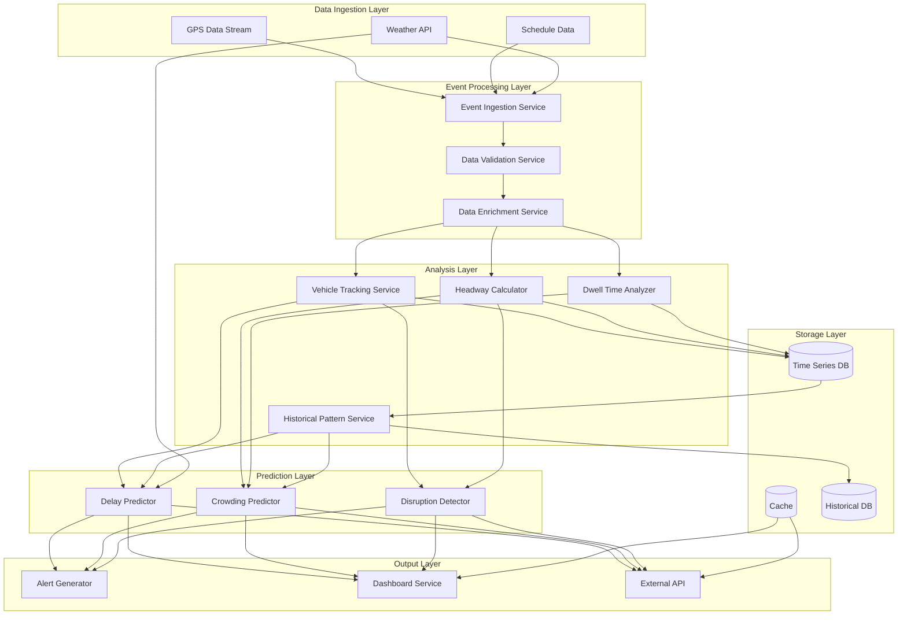

# Design Document: Urban Transport Intelligence

## Overview

The Urban Transport Intelligence system is a multi-modal predictive platform that analyzes real-time vehicle telemetry, historical patterns, and environmental data to forecast crowding, delays, and disruptions across urban public transport networks. The system operates without cameras or satellite imagery, relying instead on GPS coordinates, timing data, and weather information.

### Key Design Principles

1. **Event-Driven Architecture**: The system processes incoming GPS updates, weather events, and schedule changes as discrete events, enabling real-time responsiveness and horizontal scalability
2. **Prediction-First**: All outputs are forward-looking predictions rather than reactive reports, giving authorities and commuters time to adapt
3. **Multi-Modal by Design**: Different transport modes (bus, tram, train, metro) have distinct operational characteristics; the system maintains separate models while providing unified outputs
4. **Privacy-Preserving**: No passenger identification, tracking, or camera data; all predictions are based on aggregate vehicle behavior
5. **Graceful Degradation**: When data is missing or unreliable, the system falls back to schedule-based estimates rather than failing

### Research Context

Research on public transport prediction has demonstrated that [LSTM networks effectively capture temporal dependencies in sequential data](https://arxiv.org/html/2408.02802v1), making them suitable for delay forecasting. Studies on [headway prediction in urban rail systems](https://arxiv.org/html/2510.03121v1) show that incorporating planned terminal headways alongside historical data improves forecast accuracy. For crowding prediction, [data-driven models using context-specific features](https://dl.acm.org/doi/fullHtml/10.1145/3406962) like dwell time and headway patterns have proven effective without requiring passenger counting sensors.

Event-driven microservices architectures enable [real-time data processing at scale](https://www.gocodeo.com/post/how-event-driven-architecture-powers-real-time-microservices-at-scale), with platforms like Apache Kafka handling billions of events daily. This architectural pattern supports the asynchronous communication needed for processing continuous GPS streams while maintaining loose coupling between prediction models.

*Content was rephrased for compliance with licensing restrictions*

## Architecture

### High-Level Architecture



### Architectural Patterns

**Event-Driven Microservices**: Each service processes events asynchronously via message queues, enabling independent scaling and fault isolation. GPS updates, weather changes, and schedule modifications are published as events that trigger downstream processing.

**CQRS (Command Query Responsibility Segregation)**: Write operations (ingesting GPS data, updating predictions) are separated from read operations (serving API requests, rendering dashboards). This allows optimizing each path independently.

**Time-Series Optimization**: Vehicle positions, headways, and dwell times are stored in a time-series database optimized for temporal queries, enabling efficient historical pattern analysis.

**Caching Strategy**: Recent predictions are cached with short TTLs (30-60 seconds) to serve high-volume API requests without recomputing predictions for every query.

## Components and Interfaces

### 1. Event Ingestion Service

**Responsibility**: Receives raw data from GPS systems, schedule feeds, and weather APIs; publishes validated events to message queue

**Interfaces**:
- `ingestGPSUpdate(vehicleId, latitude, longitude, speed, timestamp)`: Accepts GPS telemetry
- `ingestScheduleUpdate(routeId, stops, times)`: Accepts schedule changes
- `ingestWeatherData(region, conditions, alerts)`: Accepts weather information

**Key Behaviors**:
- Validates data format and basic constraints (timestamp not in future, coordinates within service area)
- Assigns event IDs and ingestion timestamps
- Publishes events to appropriate topics (gps-updates, schedule-changes, weather-events)

### 2. Data Validation Service

**Responsibility**: Performs deep validation on ingested events; filters out invalid or suspicious data

**Interfaces**:
- `validateGPSEvent(event)`: Returns validation result with quality score
- `validateScheduleEvent(event)`: Checks schedule consistency
- `validateWeatherEvent(event)`: Verifies weather data freshness

**Key Behaviors**:
- Checks GPS coordinates against known route geometries
- Flags speed values exceeding physical limits for vehicle type
- Rejects timestamps outside acceptable windows
- Calculates data quality metrics
- Publishes validated events or dead-letter queue entries

### 3. Data Enrichment Service

**Responsibility**: Augments validated events with contextual information (route details, stop proximity, day type)

**Interfaces**:
- `enrichGPSEvent(event)`: Adds route, stop, and temporal context
- `enrichWithHistoricalContext(event)`: Adds relevant historical patterns

**Key Behaviors**:
- Determines which stop a vehicle is near based on GPS proximity
- Identifies day type (weekday, weekend, holiday)
- Identifies time period (peak, off-peak)
- Attaches relevant historical averages for comparison
- Publishes enriched events

### 4. Vehicle Tracking Service

**Responsibility**: Maintains current state of all vehicles; detects arrivals, departures, and off-route behavior

**Interfaces**:
- `updateVehiclePosition(vehicleId, enrichedGPSEvent)`: Updates vehicle state
- `getVehicleState(vehicleId)`: Returns current position, speed, route, last update time
- `detectArrival(vehicleId, stopId)`: Triggered when vehicle enters stop proximity
- `detectDeparture(vehicleId, stopId)`: Triggered when vehicle leaves stop proximity

**Key Behaviors**:
- Maintains in-memory state for active vehicles
- Detects arrival when speed drops below threshold within stop proximity
- Detects departure when speed increases above threshold after stop
- Flags vehicles as potentially offline after 5 minutes without updates
- Publishes arrival and departure events

### 5. Headway Calculator

**Responsibility**: Calculates time intervals between consecutive vehicles on same route; detects bunching and gaps

**Interfaces**:
- `calculateHeadway(routeId, stopId)`: Returns current headway at stop
- `detectBunching(routeId)`: Identifies service bunching
- `detectGaps(routeId)`: Identifies service gaps

**Key Behaviors**:
- Tracks vehicle order on each route
- Calculates time difference between consecutive vehicles at reference points
- Compares actual headway to scheduled headway
- Flags bunching when headway < 0.5 * scheduled
- Flags gaps when headway > 1.5 * scheduled
- Publishes headway events

### 6. Dwell Time Analyzer

**Responsibility**: Measures time vehicles spend at stops; identifies abnormal dwell patterns

**Interfaces**:
- `recordArrival(vehicleId, stopId, timestamp)`: Marks arrival time
- `recordDeparture(vehicleId, stopId, timestamp)`: Calculates and records dwell time
- `getAverageDwellTime(stopId, timeOfDay, dayType)`: Returns historical average
- `detectAbnormalDwell(vehicleId, stopId, dwellTime)`: Flags unusual dwell times

**Key Behaviors**:
- Calculates dwell time as departure timestamp minus arrival timestamp
- Compares to historical average for same stop, time, and day type
- Flags abnormal when dwell > 1.5 * historical average
- Maintains rolling averages by stop, time period, and day type
- Publishes dwell time events

### 7. Historical Pattern Service

**Responsibility**: Maintains and queries historical data; identifies temporal patterns

**Interfaces**:
- `getHistoricalDelay(routeId, stopId, timeOfDay, dayType, weatherConditions)`: Returns typical delay
- `getHistoricalCrowding(routeId, timeOfDay, dayType)`: Returns typical crowding level
- `updatePatterns()`: Periodic batch job to recalculate patterns
- `getSeasonalTrends(routeId, month)`: Returns seasonal variations

**Key Behaviors**:
- Aggregates data by route, stop, time period, day type, and weather
- Calculates rolling averages over configurable windows (e.g., 30 days)
- Identifies peak vs off-peak patterns
- Detects seasonal variations
- Stores aggregated patterns for fast retrieval

### 8. Crowding Predictor

**Responsibility**: Predicts passenger crowding levels using dwell time, headway, and historical patterns

**Interfaces**:
- `predictCrowding(vehicleId, currentStop, nextStops)`: Returns crowding predictions
- `getCrowdingLevel(vehicleId)`: Returns current crowding estimate
- `trainModel(historicalData)`: Periodic model retraining

**Key Behaviors**:
- Uses regression model with features: dwell time, headway, time of day, day type, historical crowding
- Classifies crowding as: Low (< 50% capacity), Medium (50-75%), High (75-90%), Critical (> 90%)
- Generates predictions for next 3-5 stops
- Includes confidence scores based on data quality and model uncertainty
- Falls back to historical averages when real-time data is insufficient
- Publishes crowding prediction events

**Model Approach**: Gradient boosting regression trained on historical dwell time and headway patterns, with crowding level as target variable (inferred from dwell time deviations)

### 9. Delay Predictor

**Responsibility**: Predicts arrival times at upcoming stops; identifies delays relative to schedule

**Interfaces**:
- `predictArrivalTime(vehicleId, stopId)`: Returns predicted arrival timestamp
- `getDelayEstimate(vehicleId, stopId)`: Returns delay in minutes vs schedule
- `trainModel(historicalData)`: Periodic model retraining

**Key Behaviors**:
- Uses LSTM time-series model with features: current position, speed, historical travel times, headway, weather conditions, time of day
- Predicts arrival time for each upcoming stop on route
- Calculates delay as predicted time minus scheduled time
- Adjusts predictions based on current weather conditions
- Includes confidence intervals
- Falls back to schedule-based estimates when data is insufficient
- Publishes delay prediction events

**Model Approach**: LSTM network with attention mechanism, trained on historical GPS trajectories and actual arrival times, incorporating weather and temporal features

### 10. Disruption Detector

**Responsibility**: Identifies route disruptions by analyzing patterns across multiple vehicles

**Interfaces**:
- `detectDisruption(routeId)`: Analyzes route for disruption signals
- `classifyDisruption(routeId, signals)`: Determines disruption type and severity
- `getDisruptionStatus(routeId)`: Returns current disruption state

**Key Behaviors**:
- Monitors multiple signals: vehicle count on route, off-route vehicles, extended gaps, abnormal delays
- Detects service suspension when no vehicles serve route for > 2x scheduled headway
- Detects route blockage when multiple vehicles stop progressing
- Detects off-route operation when vehicles deviate significantly from route geometry
- Classifies severity: Minor (single vehicle affected), Moderate (multiple vehicles, service continues), Severe (service suspended)
- Publishes disruption events

**Detection Logic**: Rule-based system with thresholds calibrated per transport mode (buses more tolerant of route deviations than rail)

### 11. Alert Generator

**Responsibility**: Converts predictions into actionable alerts for different audiences

**Interfaces**:
- `generateCommuterAlert(prediction)`: Creates commuter-facing alert
- `generateDriverAlert(prediction)`: Creates driver-facing alert
- `generateAuthorityAlert(prediction)`: Creates authority-facing alert
- `deliverAlert(alert, recipients)`: Sends alert via appropriate channels

**Key Behaviors**:
- Filters predictions by severity thresholds (only alert on significant issues)
- Formats alerts for target audience (commuters need route alternatives, drivers need navigation guidance)
- Includes relevant context (affected stops, estimated impact duration, alternatives)
- Deduplicates alerts to avoid notification fatigue
- Routes alerts to appropriate delivery channels (push notifications, dashboard, email)
- Publishes alert events

**Alert Types**:
- Commuter: Crowding warnings, delay notifications, disruption alerts with alternatives
- Driver: Congestion ahead, rerouting suggestions, weather warnings
- Authority: Early disruption alerts, system-wide patterns, data quality issues

### 12. Dashboard Service

**Responsibility**: Provides real-time visualization for transport authorities

**Interfaces**:
- `getCongestionHeatmap(region, timestamp)`: Returns spatial congestion data
- `getRouteStressDashboard(routeId)`: Returns route-specific metrics
- `getSystemOverview()`: Returns city-wide summary
- `getHistoricalComparison(metric, timeRange)`: Returns trend data

**Key Behaviors**:
- Aggregates predictions across routes and regions
- Generates heatmaps showing congestion levels by geographic area
- Displays route stress indicators (delay patterns, crowding, headway deviations)
- Provides filtering by transport mode, time range, severity
- Includes historical comparison for context
- Updates every 30-60 seconds

**Visualization Components**:
- City-wide congestion heatmap (color-coded by severity)
- Route stress dashboard (per-route metrics with trend indicators)
- Disruption alert panel (active disruptions with severity badges)
- System health indicators (data quality, prediction accuracy, service coverage)

### 13. External API

**Responsibility**: Provides programmatic access to predictions for third-party applications

**Interfaces**:
- `GET /predictions/crowding?route={id}&stop={id}`: Returns crowding predictions
- `GET /predictions/delays?vehicle={id}`: Returns delay predictions
- `GET /disruptions?region={id}`: Returns active disruptions
- `GET /routes/{id}/status`: Returns comprehensive route status

**Key Behaviors**:
- Authenticates requests via API keys
- Implements rate limiting (e.g., 1000 requests/hour per key)
- Returns JSON responses with standardized schema
- Includes metadata (prediction timestamp, confidence, data quality)
- Caches responses for 30-60 seconds to reduce load
- Logs usage for analytics and billing

**Response Format**:
```json
{
  "prediction_type": "crowding",
  "vehicle_id": "BUS-123",
  "route_id": "ROUTE-45",
  "predictions": [
    {
      "stop_id": "STOP-789",
      "crowding_level": "high",
      "confidence": 0.85,
      "timestamp": "2025-01-15T14:30:00Z"
    }
  ],
  "metadata": {
    "prediction_time": "2025-01-15T14:25:00Z",
    "data_quality": 0.92
  }
}
```

## Data Models

### GPS Event
```
{
  event_id: UUID
  vehicle_id: String
  route_id: String
  latitude: Float (-90 to 90)
  longitude: Float (-180 to 180)
  speed: Float (km/h, >= 0)
  timestamp: DateTime (ISO 8601)
  ingestion_time: DateTime
  data_quality: Float (0.0 to 1.0)
}
```

### Enriched GPS Event
```
{
  ...GPS Event fields
  nearest_stop_id: String
  distance_to_stop: Float (meters)
  day_type: Enum (WEEKDAY, WEEKEND, HOLIDAY)
  time_period: Enum (PEAK, OFF_PEAK, NIGHT)
  route_geometry: LineString
  historical_speed_avg: Float
}
```

### Vehicle State
```
{
  vehicle_id: String
  route_id: String
  current_position: {latitude: Float, longitude: Float}
  current_speed: Float
  current_stop_id: String | null
  status: Enum (IN_TRANSIT, AT_STOP, OFFLINE)
  last_update: DateTime
  arrival_time: DateTime | null (if at stop)
}
```

### Headway Measurement
```
{
  route_id: String
  stop_id: String
  leading_vehicle_id: String
  following_vehicle_id: String
  headway_seconds: Integer
  scheduled_headway_seconds: Integer
  deviation_ratio: Float (actual / scheduled)
  timestamp: DateTime
  status: Enum (NORMAL, BUNCHING, GAP)
}
```

### Dwell Time Measurement
```
{
  vehicle_id: String
  stop_id: String
  route_id: String
  arrival_time: DateTime
  departure_time: DateTime
  dwell_seconds: Integer
  historical_avg_seconds: Integer
  deviation_ratio: Float
  day_type: Enum
  time_period: Enum
  status: Enum (NORMAL, ABNORMAL)
}
```

### Crowding Prediction
```
{
  prediction_id: UUID
  vehicle_id: String
  route_id: String
  stop_id: String
  crowding_level: Enum (LOW, MEDIUM, HIGH, CRITICAL)
  capacity_percentage: Float (0 to 100+)
  confidence: Float (0.0 to 1.0)
  prediction_time: DateTime
  valid_until: DateTime
  contributing_factors: [String] (e.g., "high_dwell_time", "short_headway")
}
```

### Delay Prediction
```
{
  prediction_id: UUID
  vehicle_id: String
  route_id: String
  stop_id: String
  scheduled_arrival: DateTime
  predicted_arrival: DateTime
  delay_minutes: Integer (can be negative for early)
  confidence_interval: {lower: Integer, upper: Integer}
  confidence: Float (0.0 to 1.0)
  prediction_time: DateTime
  contributing_factors: [String] (e.g., "weather", "congestion", "historical_pattern")
}
```

### Disruption Event
```
{
  disruption_id: UUID
  route_id: String
  disruption_type: Enum (SERVICE_SUSPENSION, ROUTE_BLOCKAGE, OFF_ROUTE, SEVERE_DELAY)
  severity: Enum (MINOR, MODERATE, SEVERE)
  affected_stops: [String]
  detection_time: DateTime
  estimated_duration: Integer | null (minutes)
  description: String
  status: Enum (ACTIVE, RESOLVED)
}
```

### Alert
```
{
  alert_id: UUID
  alert_type: Enum (CROWDING, DELAY, DISRUPTION)
  audience: Enum (COMMUTER, DRIVER, AUTHORITY)
  severity: Enum (INFO, WARNING, CRITICAL)
  title: String
  message: String
  affected_routes: [String]
  affected_stops: [String]
  alternatives: [String] | null
  created_time: DateTime
  expires_time: DateTime
}
```

### Historical Pattern
```
{
  pattern_id: UUID
  route_id: String
  stop_id: String | null
  metric_type: Enum (DELAY, CROWDING, DWELL_TIME, HEADWAY)
  day_type: Enum
  time_period: Enum
  weather_condition: Enum | null
  average_value: Float
  std_deviation: Float
  sample_count: Integer
  calculation_date: Date
}
```

### Weather Data
```
{
  weather_id: UUID
  region_id: String
  timestamp: DateTime
  temperature: Float (Celsius)
  precipitation_intensity: Float (mm/h)
  weather_type: Enum (CLEAR, RAIN, SNOW, EXTREME_HEAT, EXTREME_COLD)
  alert_level: Enum (NONE, ADVISORY, WARNING, SEVERE)
  source: String (API provider)
}
```


## Error Handling

### Data Quality Issues

**Invalid GPS Coordinates**:
- Validation: Reject coordinates outside service area boundaries or physically impossible locations
- Fallback: Use last known valid position with staleness indicator
- Logging: Record invalid data for quality monitoring

**Missing or Delayed Data**:
- Detection: Flag vehicles without updates for > 5 minutes
- Fallback: Use schedule-based predictions with reduced confidence
- Alert: Notify authorities of data gaps affecting coverage

**Corrupted or Malformed Events**:
- Validation: Schema validation at ingestion layer
- Handling: Route to dead-letter queue for investigation
- Monitoring: Track rejection rates by source

### Prediction Failures

**Insufficient Historical Data**:
- Detection: Check sample count in historical patterns
- Fallback: Use schedule-based estimates or regional averages
- Confidence: Mark predictions with low confidence scores

**Model Uncertainty**:
- Detection: Monitor prediction confidence scores
- Handling: Widen confidence intervals or suppress low-confidence predictions
- Retraining: Trigger model retraining when accuracy degrades

**Conflicting Signals**:
- Detection: Multiple indicators suggest different outcomes
- Handling: Weight by reliability and recency; include uncertainty in output
- Escalation: Flag for manual review if conflict persists

### System Failures

**Service Unavailability**:
- Pattern: Circuit breaker pattern for external dependencies (weather API, database)
- Fallback: Serve cached data with staleness indicator
- Recovery: Exponential backoff for retry attempts

**Message Queue Overload**:
- Detection: Monitor queue depth and processing lag
- Handling: Apply backpressure; prioritize critical events (disruptions over routine updates)
- Scaling: Auto-scale consumer instances based on queue depth

**Database Connection Loss**:
- Pattern: Connection pooling with health checks
- Fallback: Serve from cache; queue writes for replay
- Alert: Notify operations team immediately

### API Error Responses

**Rate Limit Exceeded**:
- Response: HTTP 429 with Retry-After header
- Handling: Return cached data if available
- Logging: Track rate limit violations per API key

**Invalid Request**:
- Response: HTTP 400 with detailed error message
- Validation: Validate route IDs, stop IDs, timestamps
- Documentation: Provide clear API documentation

**Service Degradation**:
- Response: HTTP 503 with partial data if available
- Handling: Return predictions with reduced scope (fewer stops, lower confidence)
- Status: Provide system status endpoint

## Testing Strategy

### Unit Testing

Unit tests validate specific components and edge cases:

**Data Validation**:
- Test GPS coordinate boundary conditions (exactly at service area edge, outside boundaries)
- Test timestamp validation (future timestamps, very old timestamps, timezone handling)
- Test speed validation (zero, negative, exceeding physical limits)

**Calculation Logic**:
- Test headway calculation with edge cases (single vehicle on route, vehicles at same position)
- Test dwell time calculation (zero dwell, very long dwell, arrival without departure)
- Test disruption classification (boundary conditions for severity thresholds)

**Error Handling**:
- Test fallback behavior when historical data is missing
- Test circuit breaker state transitions
- Test dead-letter queue routing for invalid events

**API Responses**:
- Test rate limiting enforcement
- Test authentication failure handling
- Test response formatting for various prediction types

### Property-Based Testing

Property-based tests verify universal correctness properties across all inputs. Each property test should run a minimum of 100 iterations with randomized inputs.

The system will use a property-based testing library appropriate for the implementation language (e.g., Hypothesis for Python, fast-check for TypeScript/JavaScript, QuickCheck for Haskell).

Each property test must include a comment tag referencing the design document property:
```
# Feature: urban-transport-intelligence, Property {number}: {property_text}
```


## Correctness Properties

*A property is a characteristic or behavior that should hold true across all valid executions of a system—essentially, a formal statement about what the system should do. Properties serve as the bridge between human-readable specifications and machine-verifiable correctness guarantees.*

### Data Ingestion and Validation Properties

**Property 1: GPS Data Parsing Completeness**
*For any* valid GPS event, parsing should extract all required fields (vehicle ID, location, speed, timestamp) without loss of information.
**Validates: Requirements 1.1**

**Property 2: Invalid Data Rejection**
*For any* GPS event with coordinates outside service area boundaries, or timestamps in the future or excessively old, or speed exceeding physical limits, the system should reject the event and continue processing other events.
**Validates: Requirements 1.2, 13.1, 13.2, 13.3**

**Property 3: GPS Storage Precision Round-Trip**
*For any* GPS coordinate stored in the system, retrieving and comparing it to the original should show no loss of precision beyond acceptable floating-point tolerance.
**Validates: Requirements 1.5**

**Property 4: Vehicle Offline Detection**
*For any* vehicle that has not sent GPS data for more than 5 minutes, the system should indicate the vehicle as potentially offline.
**Validates: Requirements 1.4**

**Property 5: Weather Data Parsing Completeness**
*For any* valid weather event, parsing should extract all required fields (precipitation, temperature, alert levels) without loss of information.
**Validates: Requirements 6.1**

### Calculation and Analysis Properties

**Property 6: Headway Calculation Correctness**
*For any* two consecutive vehicles on the same route with known positions and timestamps, the calculated headway should equal the time difference between their passage at a reference point.
**Validates: Requirements 2.1**

**Property 7: Headway Classification Consistency**
*For any* calculated headway, if it exceeds 1.5× scheduled headway, it should be classified as a gap; if it is less than 0.5× scheduled headway, it should be classified as bunching; otherwise it should be classified as normal.
**Validates: Requirements 2.2, 2.3**

**Property 8: Dwell Time Calculation Correctness**
*For any* vehicle arrival and departure at a stop, the calculated dwell time should equal the departure timestamp minus the arrival timestamp.
**Validates: Requirements 3.2**

**Property 9: Dwell Time Measurement Triggers**
*For any* vehicle that arrives at a stop, dwell time measurement should begin; when the vehicle departs, the dwell time should be recorded with the correct stop and time period associations.
**Validates: Requirements 3.1, 3.4**

**Property 10: Abnormal Dwell Detection**
*For any* dwell time that exceeds 1.5× the historical average for that stop, time period, and day type, the system should indicate abnormal dwell behavior.
**Validates: Requirements 3.3**

**Property 11: Historical Average Updates**
*For any* new dwell time measurement, the historical average for that stop, time period, and day type should be updated to reflect the new data point.
**Validates: Requirements 3.5**

**Property 12: Transfer Time Calculation**
*For any* two stops from different transport modes, the system should calculate a transfer time based on physical distance and walking speed.
**Validates: Requirements 9.3**

### Prediction Properties

**Property 13: Crowding Level Classification**
*For any* crowding prediction, the crowding level should be one of the defined categories (LOW, MEDIUM, HIGH, CRITICAL).
**Validates: Requirements 4.2**

**Property 14: Delay Classification**
*For any* predicted arrival time that deviates from the scheduled time by more than a threshold (e.g., 5 minutes), the system should classify it as a delay.
**Validates: Requirements 5.2**

**Property 15: Prediction Confidence Inclusion**
*For any* delay or crowding prediction, the output should include a confidence score between 0.0 and 1.0.
**Validates: Requirements 5.3**

**Property 16: Weather Impact on Predictions**
*For any* route with active adverse weather conditions, delay predictions should differ from predictions without weather (typically showing longer delays or lower confidence).
**Validates: Requirements 5.4**

**Property 17: Extreme Weather Uncertainty Adjustment**
*For any* prediction made during extreme weather alerts, the confidence score should be lower than predictions made under normal weather conditions, all else being equal.
**Validates: Requirements 6.2**

**Property 18: Weather-Affected Route Identification**
*For any* adverse weather event in a region, the system should identify all routes that pass through that region as potentially affected.
**Validates: Requirements 6.3**

**Property 19: Fallback to Schedule-Based Estimates**
*For any* prediction request when real-time GPS or historical data is insufficient, the system should use schedule-based estimates and mark the prediction with reduced confidence.
**Validates: Requirements 2.5, 4.5**

### Disruption Detection Properties

**Property 20: Multi-Vehicle Disruption Detection**
*For any* route where multiple vehicles (≥ 3) simultaneously show abnormal patterns (excessive delays, off-route, stopped), the system should indicate a potential disruption.
**Validates: Requirements 7.1**

**Property 21: Off-Route Detection**
*For any* vehicle whose position deviates from its designated route geometry by more than a threshold distance (e.g., 500 meters), the system should indicate off-route behavior for applicable transport modes.
**Validates: Requirements 7.2**

**Property 22: Service Suspension Detection**
*For any* stop that has not been serviced by any vehicle for a duration exceeding 2× the scheduled headway, the system should indicate potential service suspension.
**Validates: Requirements 7.3**

**Property 23: Disruption Severity Classification**
*For any* detected disruption, the severity level should be one of the defined categories (MINOR, MODERATE, SEVERE) based on the number of affected vehicles and service impact.
**Validates: Requirements 7.4**

### Alert Generation Properties

**Property 24: Alert Generation for Critical Conditions**
*For any* prediction indicating critical crowding (>90% capacity), significant delay (>10 minutes), or disruption, the system should generate an appropriate alert for the affected audience (commuter, driver, or authority).
**Validates: Requirements 4.3, 7.5, 10.1, 10.2, 11.1, 12.3, 13.5**

**Property 25: Alternative Route Suggestions**
*For any* route experiencing disruption or severe delay, the system should suggest alternative routes using available transport modes, including relevant journey information.
**Validates: Requirements 9.4, 10.3, 10.5**

**Property 26: Driver Alert Content Completeness**
*For any* driver alert, the output should include navigation information and, if weather events affect the route, environmental warnings.
**Validates: Requirements 11.2, 11.4, 11.5**

### Multi-Modal Properties

**Property 27: Multi-Modal Data Processing**
*For any* GPS event from buses, trams, trains, or metro services, the system should process the data correctly according to the transport mode's characteristics.
**Validates: Requirements 9.1**

**Property 28: Transport Mode Identification**
*For any* prediction output, the transport mode should be clearly identified in the response.
**Validates: Requirements 9.2**

**Property 29: Mode-Specific Model Usage**
*For any* prediction, the system should use the prediction model specific to that transport mode rather than a generic model.
**Validates: Requirements 9.5**

### Historical Pattern Properties

**Property 30: Historical Data Persistence**
*For any* GPS, headway, or dwell time measurement, the system should store the data in a retrievable format for historical analysis.
**Validates: Requirements 8.1**

**Property 31: Day Type Segmentation**
*For any* historical pattern query, the system should distinguish between weekdays, weekends, and holidays, returning patterns specific to the requested day type.
**Validates: Requirements 8.2**

**Property 32: Temporal Segmentation**
*For any* historical pattern query, the system should distinguish between peak hours and off-peak hours, returning patterns specific to the requested time period.
**Validates: Requirements 8.3**

### Dashboard and API Properties

**Property 33: Congestion Heatmap Generation**
*For any* city region with active vehicles, the system should generate a congestion heatmap with color-coded severity levels based on current delay and crowding data.
**Validates: Requirements 12.1**

**Property 34: Route Stress Dashboard Completeness**
*For any* route, the dashboard should display delay patterns, crowding levels, and headway deviations.
**Validates: Requirements 12.2**

**Property 35: Historical Comparison Inclusion**
*For any* dashboard view, the system should include historical comparison data for context.
**Validates: Requirements 12.4**

**Property 36: Dashboard Filtering**
*For any* dashboard filter applied (by transport mode, time range, or severity), the displayed data should include only items matching the filter criteria.
**Validates: Requirements 12.5**

**Property 37: API Authentication Enforcement**
*For any* API request without valid authentication credentials, the system should reject the request with an appropriate error response.
**Validates: Requirements 15.2**

**Property 38: API Response Format Completeness**
*For any* successful API prediction query, the response should include transport mode, confidence indicators, timestamps, and prediction data in a structured JSON format.
**Validates: Requirements 15.3**

**Property 39: API Rate Limiting**
*For any* API key that exceeds the configured rate limit within a time window, subsequent requests should be rejected with HTTP 429 status until the window resets.
**Validates: Requirements 15.4**

### Privacy Properties

**Property 40: No Personal Data Collection**
*For any* data stored in the system, there should be no passenger identification data, camera data, facial recognition data, or individual passenger movement tracking.
**Validates: Requirements 16.1, 16.2, 16.3**

**Property 41: Vehicle Identifier Anonymization**
*For any* vehicle data older than 90 days, the vehicle identifier should be anonymized or pseudonymized.
**Validates: Requirements 16.4**

### Accuracy Monitoring Properties

**Property 42: Prediction Comparison**
*For any* prediction where the actual outcome is available, the system should compare the predicted value with the actual value and record the difference.
**Validates: Requirements 14.1**

**Property 43: Accuracy Metric Calculation**
*For any* set of predictions with actual outcomes, the system should calculate accuracy metrics (e.g., mean absolute error, RMSE) for delays and crowding.
**Validates: Requirements 14.2**

**Property 44: Low Accuracy Detection**
*For any* accuracy metric that falls below a defined threshold, the system should indicate that the model needs review.
**Validates: Requirements 14.3**

**Property 45: Context-Specific Accuracy Tracking**
*For any* accuracy metric, the system should track it separately by route, time period, and day type to identify context-specific issues.
**Validates: Requirements 14.5**

### Fault Tolerance Properties

**Property 46: Graceful Degradation**
*For any* component failure (database, weather API, message queue), the system should continue operating with degraded functionality rather than complete failure, using cached data or fallback mechanisms.
**Validates: Requirements 17.5**

